<div align="center">

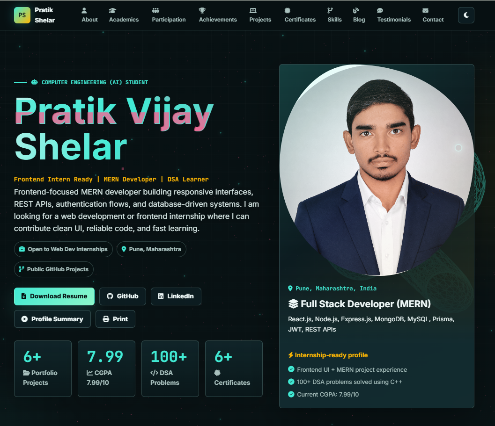

# Pratik Vijay Shelar Portfolio

### Frontend-Focused MERN Developer | Computer Engineering (AI) Student | DSA Learner

[](https://pratik-shelar-portfolio.netlify.app)
[](https://github.com/Pratik-Ghrcemp)
[](https://www.linkedin.com/in/pratik-shelar-6b66a8286/)
[](https://www.instagram.com/pratikshelar81/)
[](mailto:shelarpratik914@gmail.com)

</div>

---

## About The Portfolio

This repository contains my professional developer portfolio website, designed to present my academic background, technical skills, MERN stack projects, certificates, achievements, blog notes, testimonials, resume, and scorecard documents in one polished responsive experience.

The goal is simple: make the portfolio feel clean, modern, interactive, and recruiter-ready while still satisfying the student portfolio assignment requirements.

```js
const pratikShelar = {
  role: "Frontend-focused MERN Developer",
  education: "B.Tech Computer Engineering (Artificial Intelligence)",
  college: "G.H. Raisoni College of Engineering and Management, Pune",
  cgpa: "7.99 / 10",
  strengths: ["React UI", "REST APIs", "MongoDB", "MySQL", "DSA"],
  lookingFor: "Frontend / Web Development Internship"
};
```

## Live Preview

| Desktop Experience | Mobile Experience |
| --- | --- |
| 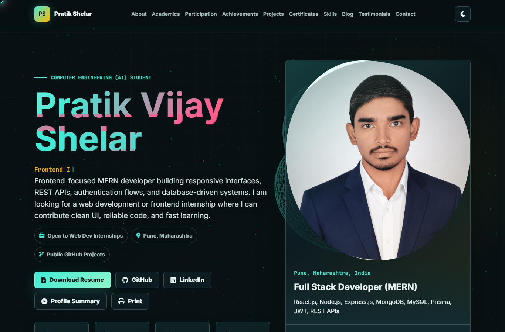 | 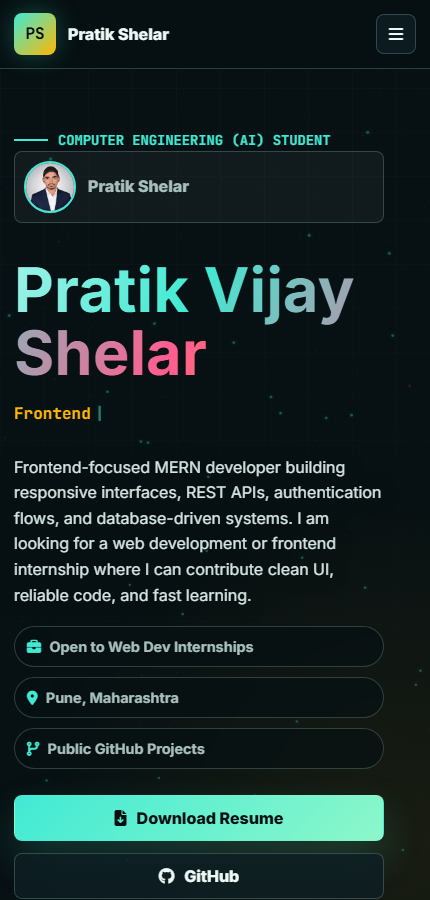 |

## Built With

<div align="center">


</div>

## Experience Highlights

| Feature | Details |
| --- | --- |
| Responsive UI | Desktop, tablet, and mobile layouts with dedicated responsive styling |
| Interactive Hero | Animated typing text, profile panel, project stats, and action buttons |
| Theme Toggle | Light and dark theme support with local storage persistence |
| Visual Effects | Three.js background, particles, reveal animations, and custom cursor |
| Project Showcase | Real screenshots, tech tags, GitHub links, and live project link |
| Academic Proof | Scorecard PDFs, institution images, certificates, and resume download |
| Contact Flow | Contact links, message form UI, social buttons, and print option |

## Portfolio Sections

### About

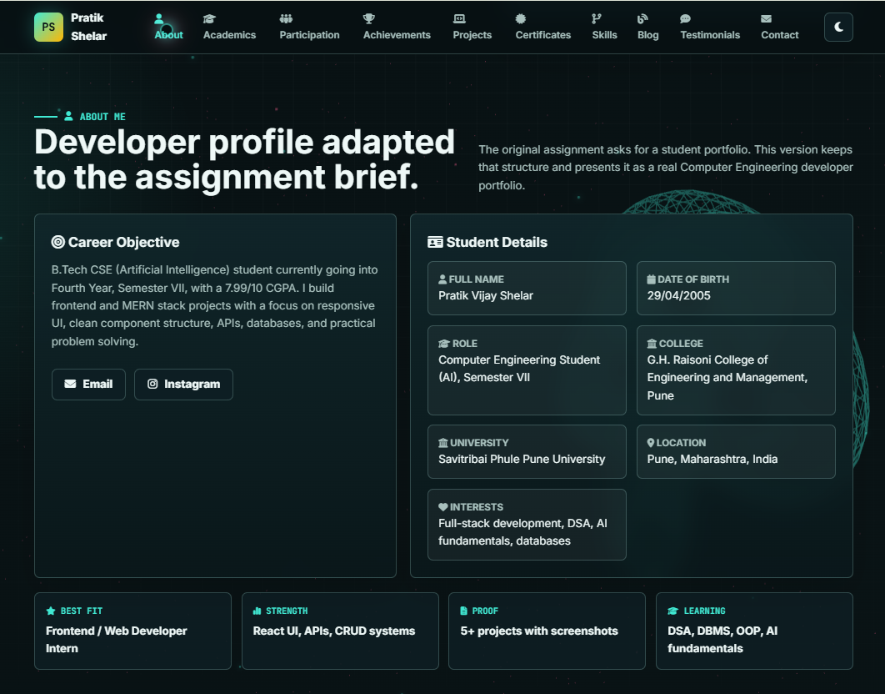

The about section introduces my developer profile, career objective, student details, college information, interests, and internship focus.

### Academics

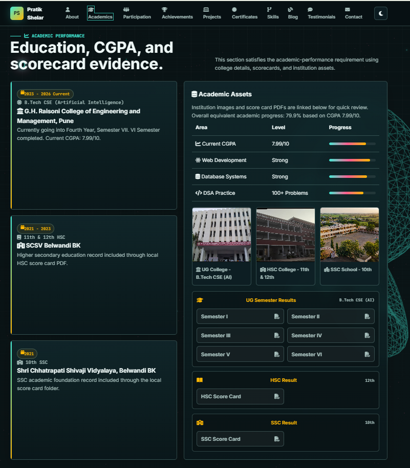

| Education | Institution | Status |
| --- | --- | --- |
| B.Tech CSE (AI) | G.H. Raisoni College of Engineering and Management, Pune | Current CGPA 7.99/10 |
| HSC | SCSV Belwandi BK | Scorecard included |
| SSC | Shri Chhatrapati Shivaji Vidyalaya, Belwandi BK | Scorecard included |

### Participation

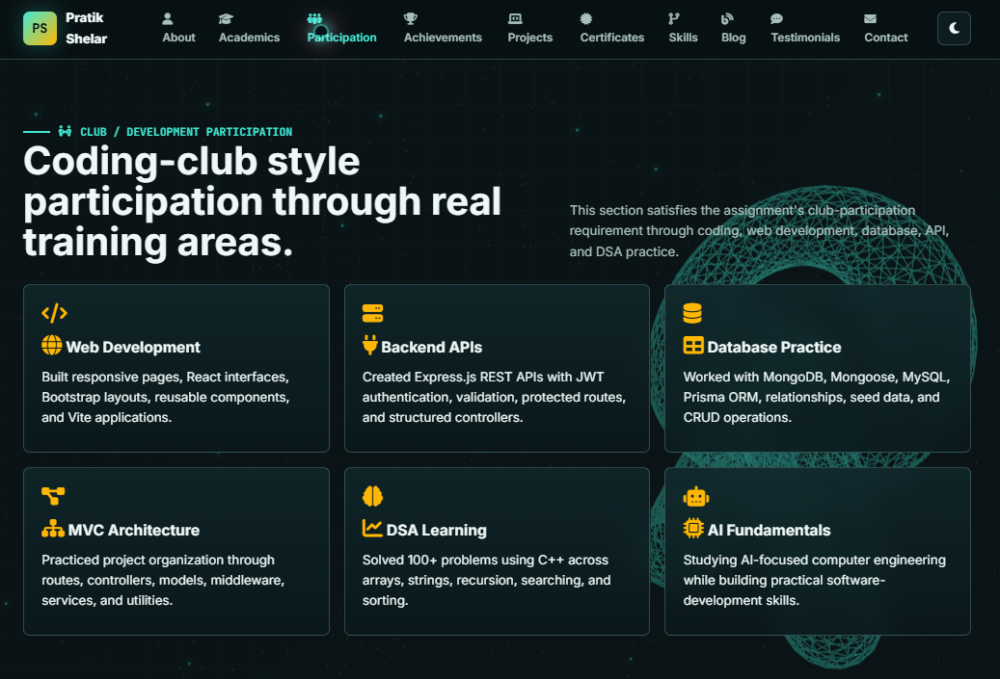

This section presents practical learning areas such as web development, backend APIs, database work, MVC architecture, DSA practice, and AI fundamentals.

### Achievements

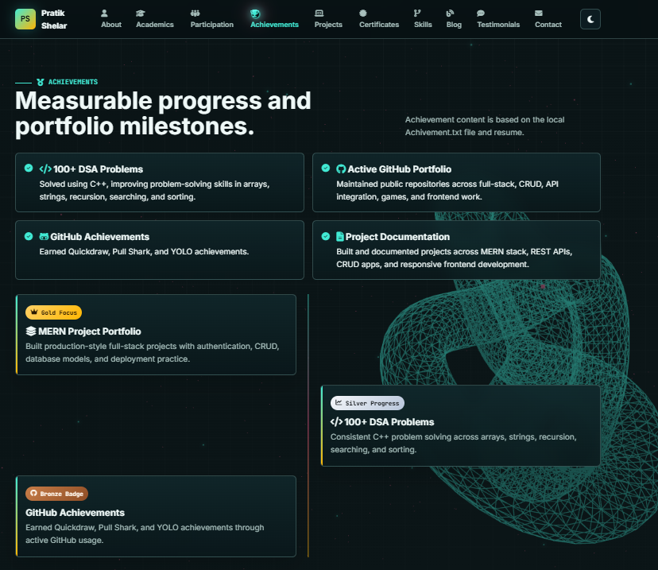

- Solved 100+ DSA problems using C++.
- Built multiple frontend, CRUD, API, and full-stack projects.
- Earned GitHub achievements such as Quickdraw, Pull Shark, and YOLO.
- Documented project work through screenshots, tech stacks, and repository links.

### Projects

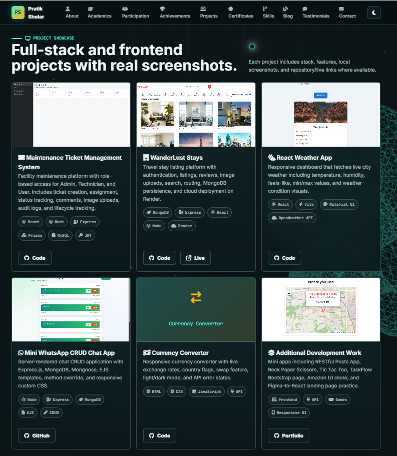

### Certificates

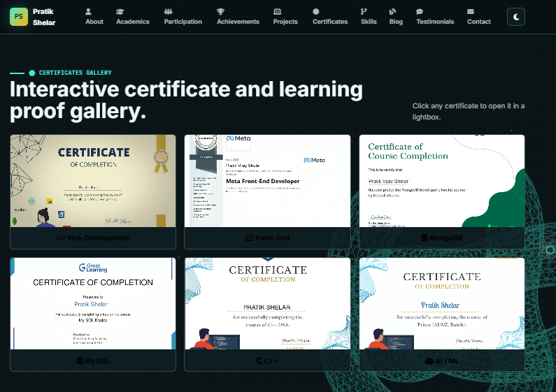

### Skills

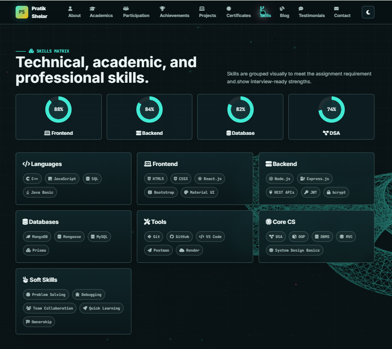

### Blog

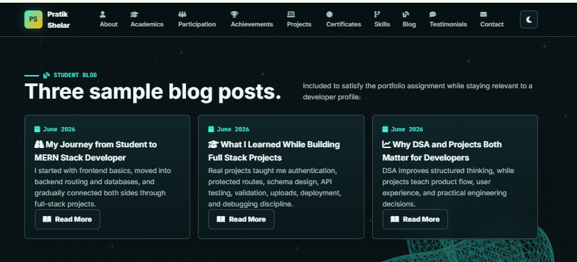

### Testimonials

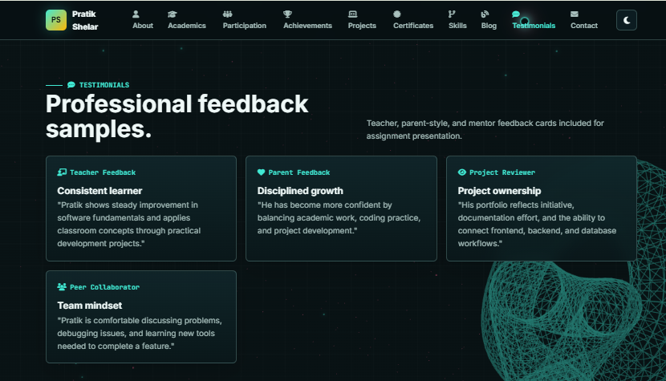

### Contact

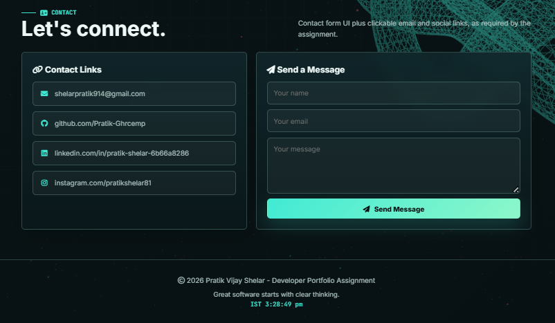

## Featured Projects

### Maintenance Ticket Management System


Role-based ticket management system with admin, technician, and user workflows. It includes ticket creation, assignment, status tracking, comments, image uploads, audit logs, authentication, and protected routes.


[](https://github.com/Pratik-Ghrcemp/maintenance-ticket-management-web-application)

### WanderLust Stays

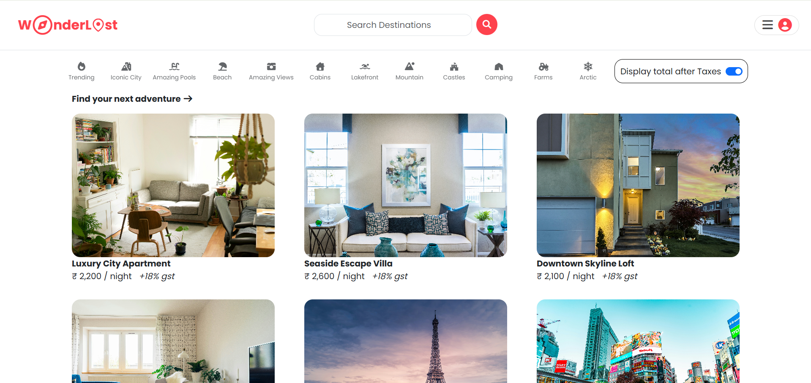

Travel listing platform with authentication, property listings, owner actions, reviews, image upload flow, location map, and cloud deployment.


[](https://github.com/Pratik-Ghrcemp/WanderLust-Stays)
[](https://wanderlust-stays-i4o9.onrender.com)

### React Weather App

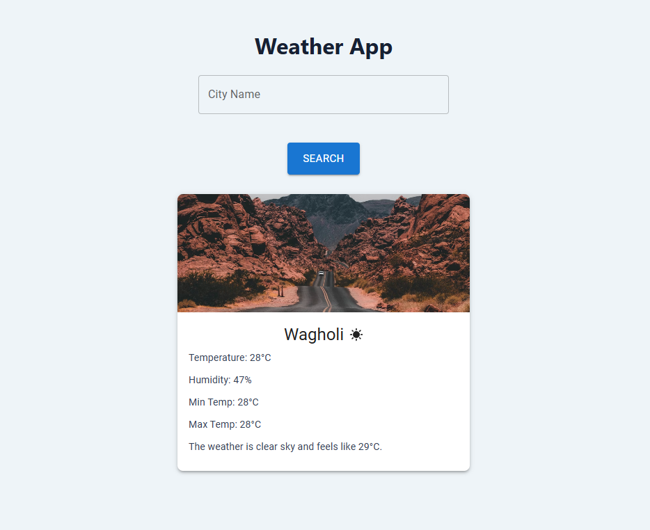

Weather search dashboard with live API data, temperature, humidity, feels-like value, min/max data, dynamic visuals, loading states, and error handling.


[](https://github.com/Pratik-Ghrcemp/react-weather-app)

### Mini WhatsApp CRUD Chat App

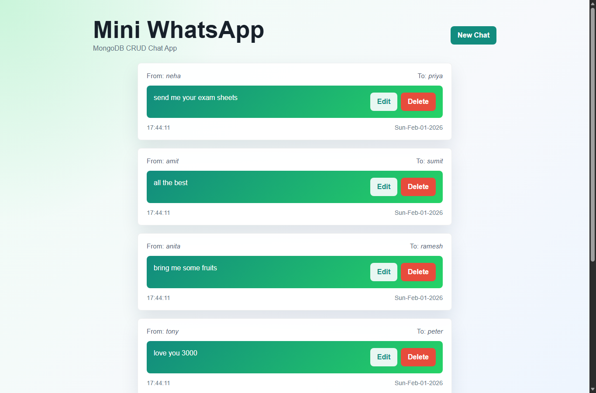

Server-rendered CRUD chat application with Express.js routes, MongoDB persistence, Mongoose models, EJS views, method override, timestamps, and WhatsApp-style UI.


[](https://github.com/Pratik-Ghrcemp)

### Currency Converter

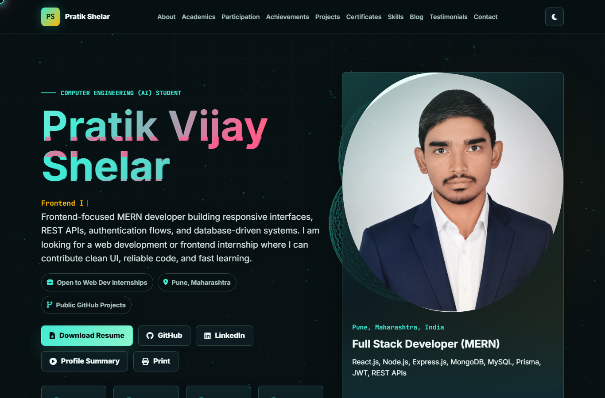

API-based currency converter with live exchange rates, country flags, swap logic, dark mode, responsive UI, and API error states.


[](https://github.com/Pratik-Ghrcemp/CurrencyConverter)

## Skills Snapshot

| Category | Skills |
| --- | --- |
| Languages | C++, JavaScript, SQL, Java Basic |
| Frontend | HTML5, CSS3, React.js, Bootstrap, Material UI, Responsive Design |
| Backend | Node.js, Express.js, REST APIs, JWT, bcrypt |
| Databases | MongoDB, Mongoose, MySQL, Prisma |
| Core CS | DSA, OOP, DBMS, MVC, System Design Basics |
| Tools | Git, GitHub, VS Code, Postman, Render |
| Soft Skills | Problem Solving, Debugging, Collaboration, Quick Learning, Ownership |

## Developer Metrics

| Area | Level |
| --- | --- |
| Frontend Development | 88% |
| Backend Development | 84% |
| Database Systems | 82% |
| DSA Practice | 74% |
| Current CGPA | 7.99 / 10 |
| DSA Problems | 100+ |

## Repository Structure

```text
pratik-shelar-portfolio/
|-- index.html
|-- README.md
|-- .gitignore
|-- css/
|   `-- style.css
|-- js/
|   |-- main.js
|   |-- animations.js
|   `-- components.js
`-- assets/
    |-- docs/
    |   |-- resume/
    |   `-- scorecards/
    `-- images/
        |-- certificates/
        |-- institutions/
        |-- profile/
        |-- projects/
        `-- readme/
```

## Run Locally

```bash
git clone https://github.com/Pratik-Ghrcemp/Pratik-Shelar-Portfolio.git
cd Pratik-Shelar-Portfolio
code .
```

Open `index.html` directly in a browser, or run it with the VS Code Live Server extension.

## Deployment

This is a static portfolio, so it can be deployed easily on:

- GitHub Pages
- Netlify
- Vercel
- Render Static Sites

Recommended settings:

| Setting | Value |
| --- | --- |
| Build command | Not required |
| Publish directory | Project root |
| Entry file | `index.html` |

## GitHub Stats

<div align="center">


</div>

## Connect With Me

<div align="center">

[](https://pratik-shelar-portfolio.netlify.app)
[](https://github.com/Pratik-Ghrcemp)
[](https://www.linkedin.com/in/pratik-shelar-6b66a8286/)
[](https://www.instagram.com/pratikshelar81/)
[](mailto:shelarpratik914@gmail.com)

</div>

## Author

**Pratik Vijay Shelar**  
Frontend-focused MERN Developer | Computer Engineering (AI) Student | DSA Learner

## License

Copyright 2026 Pratik Vijay Shelar. All rights reserved.

<div align="center">

### Build clean. Ship sharp. Let the work speak.

</div>
